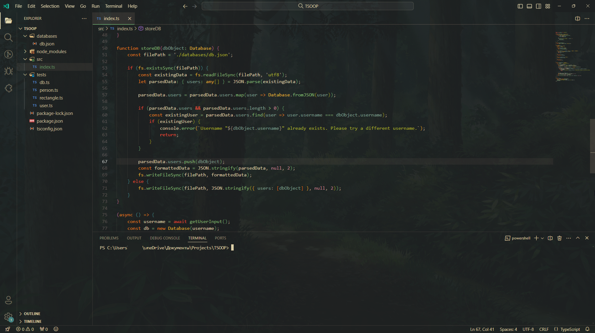

Plugins you need: [Gruvbox Theme](https://marketplace.visualstudio.com/items?itemName=jdinhlife.gruvbox), [Background](https://marketplace.visualstudio.com/items?itemName=shalldie.background), [Nomo Dark Icon Theme](https://marketplace.visualstudio.com/items?itemName=be5invis.vscode-icontheme-nomo-dark), [Developer's theme](https://marketplace.visualstudio.com/items?itemName=Rajeshwaran.developer-theme-dark).

Images [here](./images/).

Config [here](./config/settings.json).
